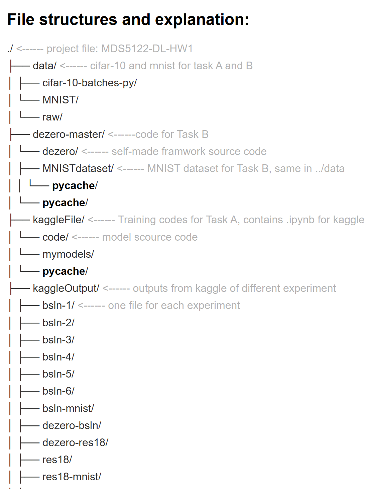

### File structures and explanation:

```text
./                                     # Project root: MDS5122-DL-HW1
├── data/                             # CIFAR-10 and MNIST for Task A/B
│   ├── cifar-10-batches-py/
│   └── MNIST/
│       └── raw/
├── dezero-master/                    # Code for Task B
│   └── dezero/                      # Self-made framework source code
│       ├── MNISTdataset/            # MNIST dataset (same as ../data)
│       │   └── __pycache__/
│       └── __pycache__/
├── kaggleFile/                       # Training codes for Task A (.ipynb)
│   └── code/                        # Model source code
│       └── mymodels/
│           └── __pycache__/
├── kaggleOutput/                     # Kaggle experiment outputs
│   ├── bsln-1/                      # One directory per experiment
│   ├── bsln-2/
│   ├── bsln-3/
│   ├── bsln-4/
│   ├── bsln-5/
│   ├── bsln-6/
│   ├── bsln-mnist/
│   ├── dezero-bsln/
│   ├── dezero-res18/
│   ├── res18/
│   ├── res18-mnist/
│   ├── res50/
│   └── vgg16/
└── texfile/                          # LaTeX files
    └── fig/
```

<!--  -->